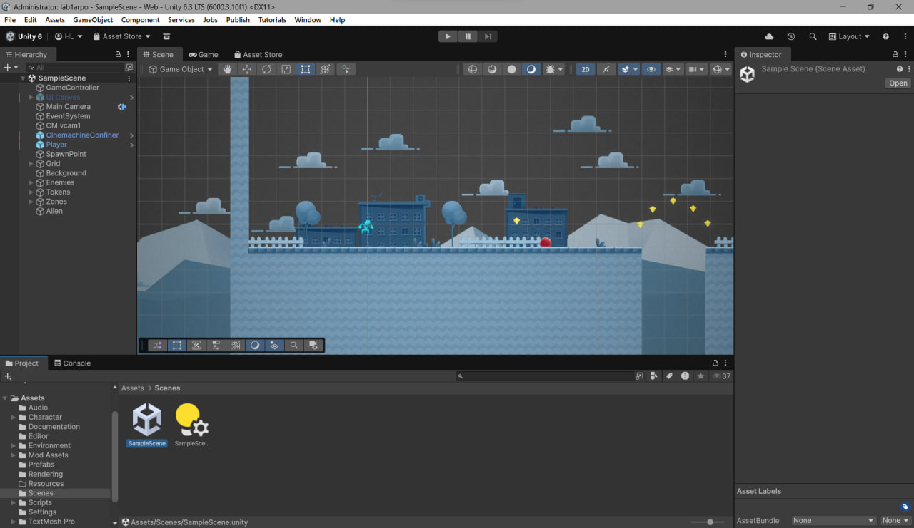
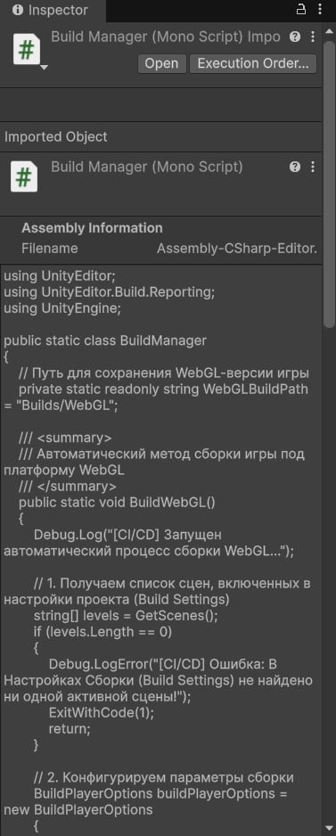
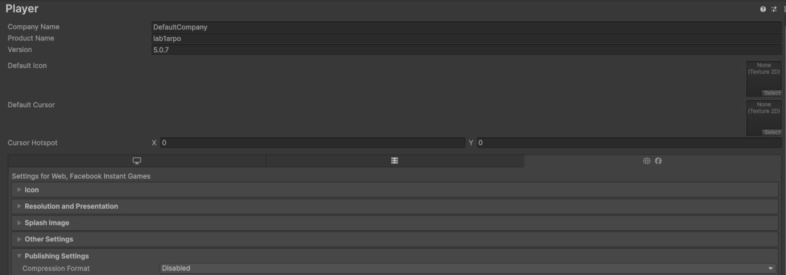
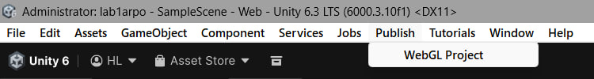
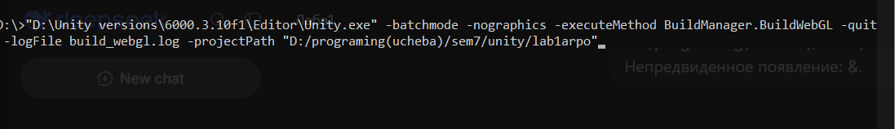
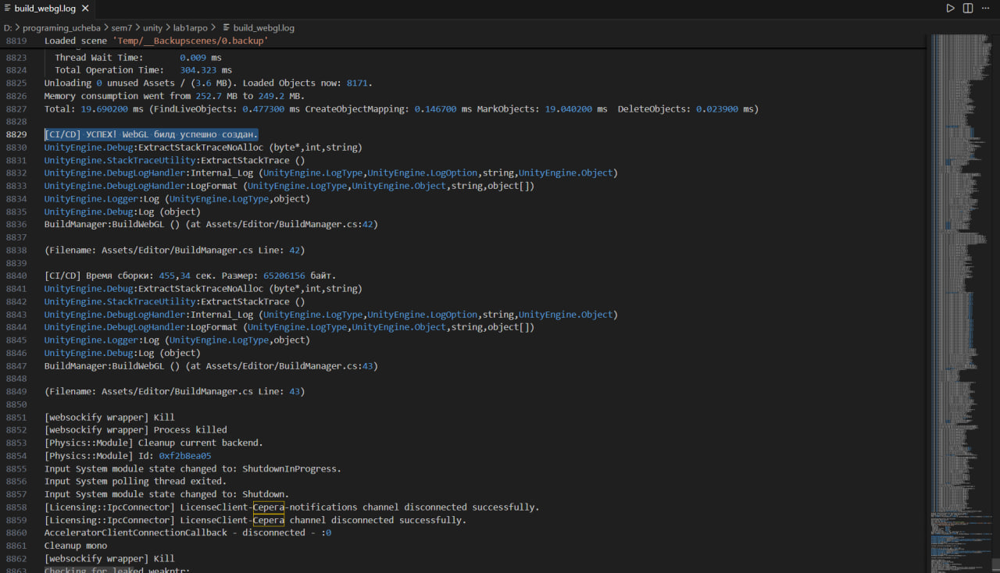
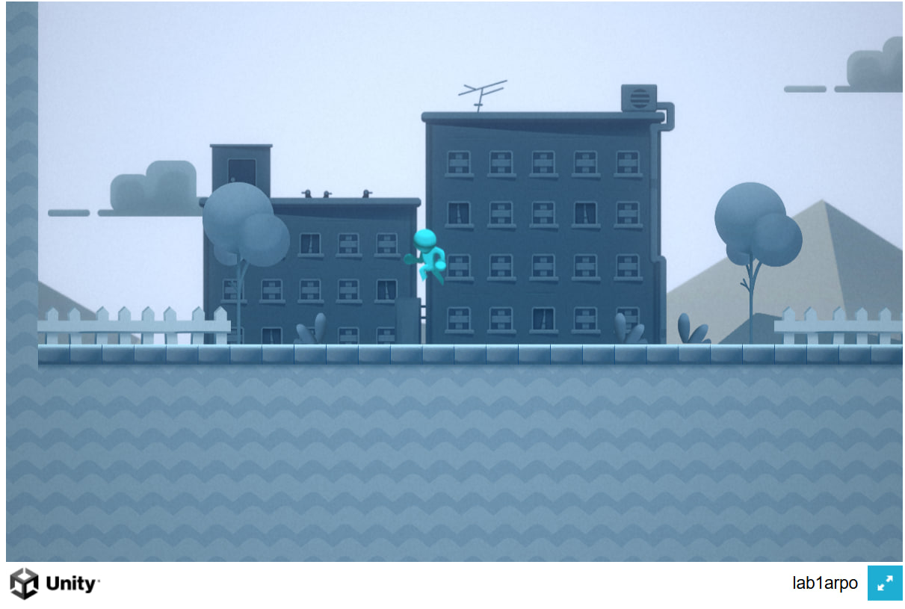
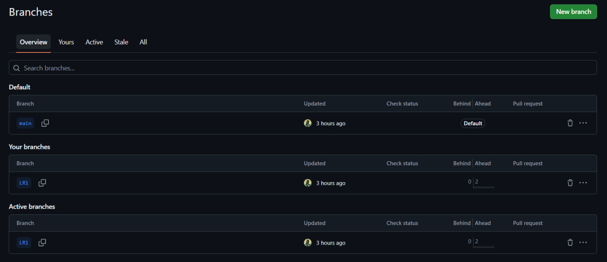
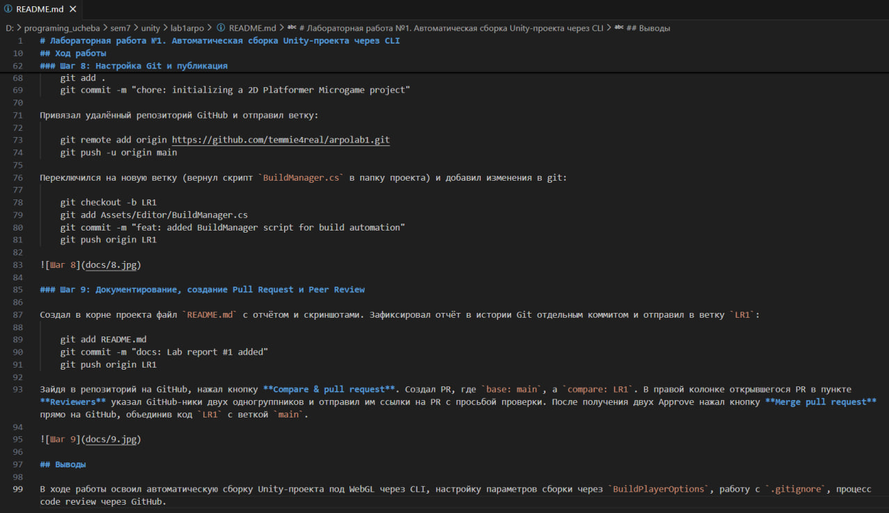

# Лабораторная работа №1. Автоматическая сборка Unity-проекта через CLI

**Студент:** Сергей Шнитко
**Репозиторий:** https://github.com/temmie4real/arpolab1

## Цель работы

Освоить автоматическую сборку Unity-проекта под WebGL через интерфейс командной строки (CLI), настроить `.gitignore`, оформить процесс через Git и pull request.

## Ход работы

### Шаг 1: Инициализация проекта

Запустил Unity Hub, создал новый проект на базе официального шаблона **2D Platformer Microgame**. Открыл проект в Unity, перешёл в папку `Assets/Scenes/` и убедился, что основная сцена игры добавлена и активна в окне `File → Build Settings`. Запустил проект средствами Unity, изучил структуру и исходный код.

### Шаг 2: Создание C# скрипта сборщика

В окне Project внутри папки `Assets` создал новую папку с именем `Editor`. Внутри `Assets/Editor/` создал новый C# скрипт `BuildManager.cs` и заменил его содержимое кодом из методички: класс `BuildManager` с методом `BuildWebGL()`, вспомогательным методом `GetScenes()` и `ExitWithCode()`.

### Шаг 3: Отключение сжатия для WebGL

В Unity перешёл в `Edit → Project Settings → Player`. Выбрал вкладку с иконкой планеты/HTML5 (настройки WebGL). Развернул подраздел `Publishing Settings` и переключил `Compression Format` со значения `Gzip` на `Disabled`. Сохранил проект (Ctrl + S) и полностью закрыл редактор Unity.

### Шаг 4: Проверка скрипта через интерфейс Unity

Вернулся в редактор Unity, дождался компиляции проекта. Убедился, что в верхнем меню появился новый кастомный пункт, и что в `File → Build Settings` добавлена хотя бы одна сцена игры.

### Шаг 5: Локальная сборка через терминал (CLI)

Полностью закрыл редактор Unity. Открыл консоль (cmd) в корневой папке проекта и выполнил команду автоматической сборки:

    "D:\Unity versions\6000.3.10f1\Editor\Unity.exe" -batchmode -nographics -executeMethod BuildManager.BuildWebGL -quit -logFile build_webgl.log -projectPath "D:/programing_ucheba/sem7/unity/lab1arpo"

Процесс шёл в фоне 1–3 минуты.

### Шаг 6: Анализ результатов и логов сборки

Убедился, что в корне проекта появился файл `build_webgl.log`. Открыл его и нашёл в самом конце строку:

    [CI/CD] УСПЕХ! WebGL билд успешно создан.

Также убедился, что в папке `Builds/WebGL/` появились скомпилированные веб-файлы игры: `index.html`, папки `Build` и `StreamingAssets`.

### Шаг 7: Проверка работоспособности (локальный запуск)

Открыл папку `Builds/WebGL/` в VS Code. Запустил расширение Live Server (кнопка Go Live в правом нижнем углу VS Code). Браузер автоматически открыл страницу `http://127.0.0.1:5500`. Проверил игру вручную: полоса загрузки Unity дошла до конца, главный экран микроигры отображается корректно, персонаж реагирует на управление.

### Шаг 8: Настройка Git и публикация

Создал в корневой директории файл `.gitignore`. Инициализировал репозиторий и зафиксировал базовое состояние проекта (чистый шаблон игры без `BuildManager.cs`, для этого временно переместил файл из каталога проекта, чтобы он не попал в ветку `main`):

    git init
    git branch -M main
    git add .
    git commit -m "chore: initializing a 2D Platformer Microgame project"

Привязал удалённый репозиторий GitHub и отправил ветку:

    git remote add origin https://github.com/temmie4real/arpolab1.git
    git push -u origin main

Переключился на новую ветку (вернул скрипт `BuildManager.cs` в папку проекта) и добавил изменения в git:

    git checkout -b LR1
    git add Assets/Editor/BuildManager.cs
    git commit -m "feat: added BuildManager script for build automation"
    git push origin LR1

### Шаг 9: Документирование, создание Pull Request и Peer Review

Создал в корне проекта файл `README.md` с отчётом и скриншотами. Зафиксировал отчёт в истории Git отдельным коммитом и отправил в ветку `LR1`:

    git add README.md
    git commit -m "docs: Lab report #1 added"
    git push origin LR1

Зайдя в репозиторий на GitHub, нажал кнопку **Compare & pull request**. Создал PR, где `base: main`, а `compare: LR1`. В правой колонке открывшегося PR в пункте **Reviewers** указал GitHub-ники двух одногруппников и отправил им ссылки на PR с просьбой проверки. После получения двух Approve нажал кнопку **Merge pull request** прямо на GitHub, объединив код `LR1` с веткой `main`.

## Выводы

В ходе работы освоил автоматическую сборку Unity-проекта под WebGL через CLI, настройку параметров сборки через `BuildPlayerOptions`, работу с `.gitignore`, процесс code review через GitHub.