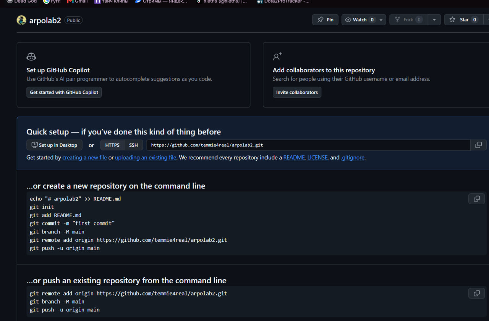
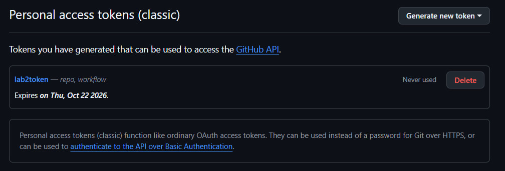
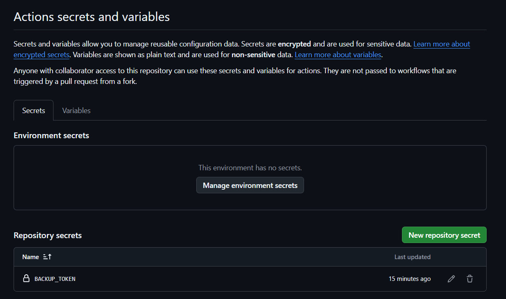
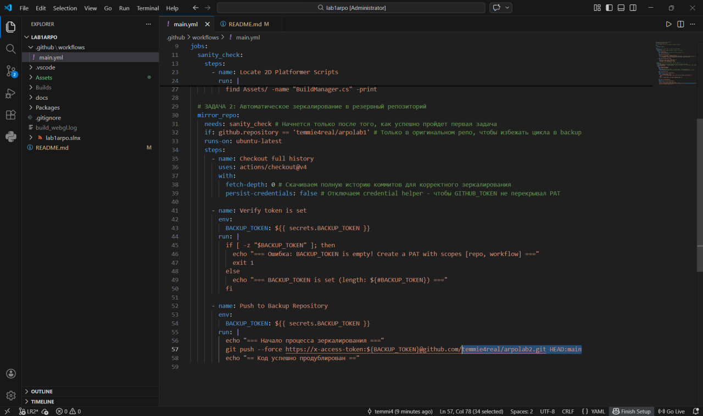
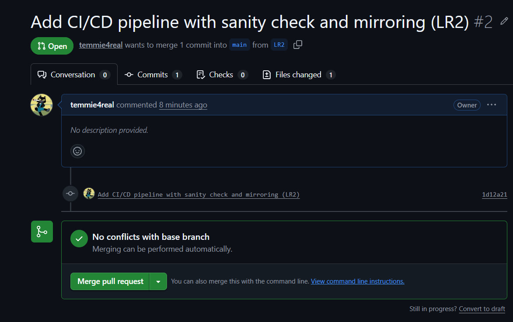
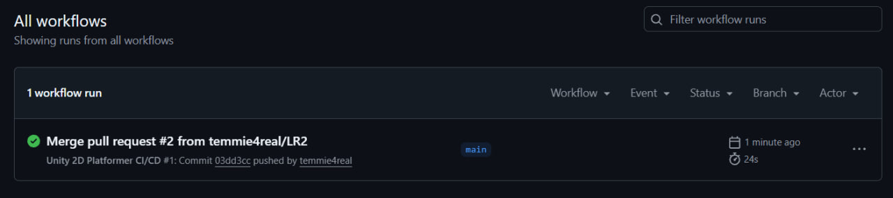
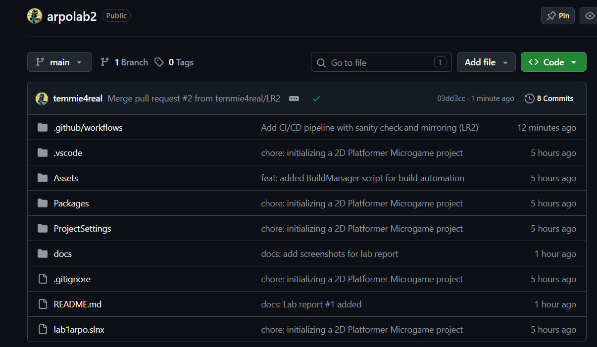

Лабораторная работа №2. Настройка CI/CD пайплайна на GitHub Actions
Студент: Сергей Шнитко
Репозитории:
https://github.com/temmie4real/arpolab1
https://github.com/temmie4real/arpolab2

Цель работы
Изучение принципов построения декларативных сценариев непрерывной интеграции (CI) на платформе GitHub Actions. Приобретение навыков автоматизации процессов верификации структуры проекта (Sanity Check), безопасного управления секретами репозитория и настройки процессов автоматического зеркалирования исходного кода в резервную инфраструктуру.

Ход работы
Шаг 1: Создание резервного репозитория для зеркалирования
Зайдя на свой GitHub, создал второй, пустой репозиторий и назвал его arpolab2. При создании не добавлял файлы README или .gitignore, чтобы GitHub Actions мог беспрепятственно зеркалировать туда код. Скопировал URL-адрес резервного репозитория.

Шаг 2: Генерация токена доступа (PAT Token)
В правом верхнем углу GitHub нажал на своё фото профиля → Settings. В самом низу левого меню выбрал Developer settings. Перешёл в Personal access tokens → Tokens (classic). Нажал Generate new token (classic). Написал название Backup-Token и поставил галочки напротив пунктов repo (доступ к репозиториям) и workflow. Нажал Generate token внизу страницы и обязательно скопировал появившийся длинный буквенно-цифровой код (он показывается только один раз).

Шаг 3: Сохранение токена в секреты основного проекта
Перешёл на страницу основного репозитория arpolab1. Открыл вкладку Settings (верхняя панель). В левом меню развернул вкладку Secrets and variables и нажал Actions. Нажал большую зелёную кнопку New repository secret. В поле Name ввёл строго заглавными буквами: BACKUP_TOKEN. В поле Value вставил скопированный на Шаге 2 длинный токен. Нажал Add secret.

Шаг 4: Написание единого YAML пайплайна
Открыл свою среду разработки в корне проекта игры. Создал папку с именем .github, внутри неё создал папку workflows (имена папок критически важны, строго с маленькой буквы и через точку: .github/workflows/). Внутри папки workflows создал файл main.yml и вставил в него универсальный код автоматизации, заменив nbrouka/2d_platformer и nbrouka/2d_platformer_backup на свои значения:

Шаг 5: Отправка пайплайна на GitHub
Сохранил файл main.yml (Ctrl + S), создал новую ветку LR2 и добавил изменения в git:

git checkout -b LR2
git add .github/workflows/main.yml
git commit -m "feat: added CI/CD pipeline with sanity check and mirroring"
git push origin LR2

Зайдя в репозиторий на GitHub, нажал кнопку Compare & pull request. Создал PR, где base: main, а compare: LR2. После проверки нажал кнопку Merge pull request прямо на GitHub, объединив код LR2 с веткой main.

Шаг 6: Проверка результатов и отчёт
Открыл основной репозиторий на сайте GitHub и перешёл во вкладку Actions. Увидел запущенный рабочий процесс Unity 2D Platformer CI/CD. Кликнул по нему — там отображаются две зелёные галочки напротив задач sanity_check и mirror_repo.

Зайдя в резервный репозиторий arpolab2, обнаружил, что он перестал быть пустым — GitHub Actions сам полностью скопировал туда весь код, структуру папок и историю коммитов.

Обновил файл README.md в основном репозитории, дополнив его шагами из ЛР№2 и скриншотами. Зафиксировал отчёт в истории Git отдельным коммитом и отправил в ветку main:

git add README.md
git commit -m "docs: Lab report #2 added"
git push origin main

Выводы
В ходе работы освоил построение декларативных CI-сценариев на GitHub Actions, настройку триггеров и зависимостей между задачами (needs), безопасное управление секретами через Repository Secrets, а также автоматическое зеркалирование исходного кода в резервный репозиторий с использованием Personal Access Token.